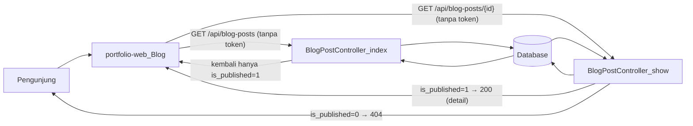
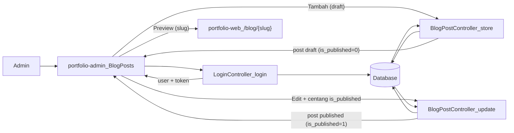

# Dokumentasi Alur Konten Post

Dokumen ini menjelaskan alur **konten blog post** dari dua sisi:

- **Pengunjung (web publik)** melalui `portfolio-web`.
- **Admin** yang mengelola konten melalui `portfolio-admin`.

Fokus utama ada pada resource `blog-posts`, flag `is_published`, serta bagaimana API (`portfolio-api`) membedakan respon untuk publik vs admin.

---

## 1. Ringkasan

- **portfolio-web** menampilkan daftar dan detail blog post kepada pengunjung.
  - Hanya post yang sudah dipublikasi (`is_published = true`) yang bisa dilihat pengunjung.
- **portfolio-admin** dipakai admin untuk membuat, mengedit, dan mem-publish blog post.
  - Admin dapat menyimpan **draft** (belum dipublikasi) dan kemudian mengubahnya menjadi **published**.
- **portfolio-api** menjadi satu-satunya pintu ke database dan:
  - Menyaring data berdasarkan `auth()->check()` dan nilai `is_published`.
  - Menyediakan endpoint yang sama untuk publik dan admin; perbedaan akses diatur di controller.

---

## 2. Alur Pengunjung (Web Publik)

### 2.1 Daftar blog post

1. Pengunjung membuka halaman `Blog` di `portfolio-web` (`/blog`).
2. Komponen `Blog`:
   - Memanggil `getUsers({ per_page: 1 })` untuk mengambil user pertama (pemilik portfolio).
   - Memanggil `getBlogPosts({ user_id: first.id, per_page: 10, page })` **tanpa token**.
3. Fungsi `getBlogPosts` di `portfolio-web/src/api.js` melakukan `GET` ke:
   - `/api/blog-posts?user_id={id}&per_page=10&page={page}` (tanpa header Authorization).
4. Di API, `BlogPostController@index`:
   - Menerapkan filter `user_id` bila tersedia.
   - Jika `auth()->check() === false` (publik), menambah filter `where('is_published', true)`.
   - Mengembalikan hasil dalam bentuk pagination (field `data`, `total`, dll.).
5. Komponen `Blog` menampilkan:
   - Judul (`title`), tanggal publikasi (`published_at`), excerpt, dan tag (jika ada).
   - Pagination berdasarkan `total` dan `per_page`.

**Implikasi untuk publik:**

- Post yang masih draft (`is_published = false`) **tidak pernah muncul** di daftar blog publik.

### 2.2 Detail blog post

1. Pengunjung mengklik salah satu post di daftar; router berpindah ke `/blog/{id}`.
2. Komponen `PostDetail` mengambil `id` dari URL dan memanggil `getBlogPost(id)` **tanpa token**.
3. Fungsi `getBlogPost` di `portfolio-web/src/api.js` melakukan `GET` ke:
   - `/api/blog-posts/{id}` (tanpa header Authorization).
4. Di API, `BlogPostController@show`:
   - Mencari post dengan `BlogPost::with(['user', 'tags'])->find($id)`.
   - Jika tidak ditemukan → mengembalikan 404.
   - Jika `auth()->check() === false` dan `$item->is_published === false` → juga mengembalikan 404.
5. Jika ditemukan dan dipublikasi:
   - API mengembalikan detail post, termasuk konten markdown (`content`), excerpt, `published_at`, dan relasi `tags`.
   - `PostDetail` merender title, tanggal, excerpt, dan `content` melalui `MarkdownContent`, serta daftar tag.

**Implikasi untuk publik:**

- Mengakses ID post yang masih draft menghasilkan **404** (seolah post tidak ada).
- Hanya post yang sudah dipublikasi yang bisa dibaca penuh oleh pengunjung.

---

## 3. Alur Admin Mengelola Konten Post

### 3.1 Login dan konteks user

1. Admin membuka `portfolio-admin` dan login.
2. Setelah login berhasil:
   - API login mengembalikan objek `user` dan `token`.
   - Admin menyimpan current user (mis. ke `sessionStorage`) melalui util `auth.js`.
3. Current user ini dipakai untuk mengisi otomatis `user_id` saat membuat konten baru.

### 3.2 Membuat draft blog post

1. Admin membuka menu `Blog Posts` di panel admin.
2. Di halaman resource `blog-posts`:
   - Konfigurasi di `portfolio-admin/src/resourceConfig.js` mendeskripsikan:
     - Endpoint: `blog-posts`.
     - Field form: `user_id`, `title`, `slug`, `excerpt`, `content` (markdown), `published_at`, `is_published`.
     - Filter list: `user_id`, `is_published`.
3. Admin mengklik tombol **Tambah**:
   - `ResourcePage` memanggil `openCreate()`.
   - `openCreate()` mengisi `formData.user_id` dengan `currentUser.id` bila tersedia.
   - Field lain diinisialisasi kosong atau false (untuk checkbox `is_published`).
4. Admin mengisi judul, slug (opsional), excerpt, dan konten markdown.
   - Jika slug dikosongkan, API akan mengisi otomatis dari title (menggunakan `Str::slug`).
5. Admin menyimpan form dengan `is_published` **belum dicentang**:
   - `ResourcePage` mengirim body ke endpoint `POST /api/blog-posts` melalui helper `create()`.
   - API `BlogPostController@store` memvalidasi data dan membuat record baru dengan `is_published` bernilai `false` (atau null).
6. Hasil:
   - Post tersimpan sebagai **draft**.
   - Post **belum muncul** di daftar blog publik.

### 3.3 Mengedit dan mem-publish post

1. Di daftar `Blog Posts`, admin memilih item dan mengklik **Edit**:
   - `ResourcePage` memanggil `getOne('blog-posts', id)` untuk mengambil data terbaru.
   - Field form diisi ulang berdasarkan konfigurasi `formFields`.
2. Admin memperbarui konten dan metadata:
   - Mengedit markdown `content`, `excerpt`, `title`, atau `slug`.
   - Mengisi `published_at` dengan tanggal/waktu publikasi yang diinginkan.
   - Mencentang checkbox `is_published` untuk menandai post sebagai published.
3. Admin menyimpan perubahan:
   - `ResourcePage` mengirim body ke endpoint `PUT /api/blog-posts/{id}` atau `PATCH /api/blog-posts/{id}`.
   - API `BlogPostController@update` memvalidasi perubahan dan meng-update record.
4. Setelah tersimpan dengan `is_published = true`:
   - `BlogPostController@index` tidak lagi menyaring post tersebut untuk request publik (karena memenuhi filter).
   - Post mulai muncul di daftar blog publik (`GET /api/blog-posts` tanpa token).
   - Detail post dapat diakses oleh pengunjung melalui `GET /api/blog-posts/{id}`.

### 3.4 Preview post dari admin

1. Konfigurasi `blog-posts` di `resourceConfig.js` menyetel:
   - `previewBaseUrl: import.meta.env.VITE_SITE_URL || ''`.
   - `previewSlugField: 'slug'`.
   - `previewPathPrefix: '/blog/'`.
2. Di `ResourcePage`, saat form atau list sedang aktif, admin dapat melihat tombol **Preview** jika:
   - Field `slug` terisi.
   - `previewBaseUrl` dan `previewSlugField` tersedia.
3. Tombol **Preview** akan membuka URL publik berbentuk:
   - `{SITE_URL}/blog/{slug}`
   - sehingga admin dapat memeriksa tampilan post di sisi web publik sesuai konfigurasi routing yang berlaku.

---

## 4. Diagram Alur

### 4.1 Alur pengunjung membaca post

### 4.2 Alur admin membuat & mem-publish post

---

## 5. Relasi dengan Dokumen Lain

- `[docs/ARSITEKTUR.md](ARSITEKTUR.md)` — memberikan gambaran besar stack (API, admin, web, database).
- `[docs/PUBLIKASI_WEB.md](PUBLIKASI_WEB.md)` — menjelaskan perilaku API publik vs admin untuk `blog-posts` dan `projects` dalam bentuk tabel.
- `[docs/PERANCANGAN_ADMIN.md](PERANCANGAN_ADMIN.md)` — merinci perancangan admin (login, current user, auto-fill `user_id`, konfigurasi `resourceConfig`, dan tampilan relasi).

Dokumen **Alur Konten Post** ini melengkapi ketiganya dengan narasi langkah-demi-langkah tentang bagaimana sebuah blog post mengalir:

1. Dibuat sebagai draft oleh admin.
2. Dipublish dan mulai muncul di API.
3. Ditampilkan di situs publik dan dapat dibaca pengunjung.

---

## 6. Referensi File

- API:
  - `portfolio-api/app/Http/Controllers/BlogPostController.php`
  - `portfolio-api/routes/web.php` (route `blog-posts`)
- Web (publik):
  - `portfolio-web/src/api.js` — `getBlogPosts`, `getBlogPost`.
  - `portfolio-web/src/pages/Blog.jsx` — daftar blog.
  - `portfolio-web/src/pages/PostDetail.jsx` — detail post.
  - `portfolio-web/src/App.jsx` — routing `/blog` dan `/blog/:id`.
- Admin:
  - `portfolio-admin/src/resourceConfig.js` — konfigurasi `blog-posts`.
  - `portfolio-admin/src/pages/ResourcePage.jsx` — form & list generik, termasuk Preview.
  - `portfolio-admin/src/auth.js` dan `portfolio-admin/src/pages/Login.jsx` — login & current user.

