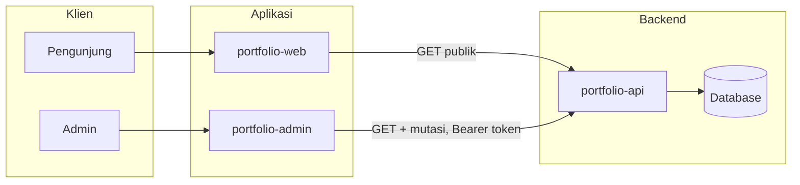

# Arsitektur Portfolio Stack

Dokumen ini memberikan gambaran sistem secara keseluruhan: komponen, alur akses, dan pembagian antara pengunjung (publik) dan admin.

---

## Ringkasan

Stack terdiri dari:

- **portfolio-api** — Backend Lumen (PHP). REST API untuk semua resource; autentikasi Bearer token untuk akses admin.
- **portfolio-admin** — Frontend React (Vite) untuk pengelola konten: login, dashboard, CRUD, menu dropdown, relasi tampil nama.
- **portfolio-web** — Frontend React (Vite) untuk pengunjung: halaman portfolio, blog, kontak.
- **Database** — MySQL/MariaDB; digunakan oleh API.

Admin dan web sama-sama memanggil API. Akses dibedakan berdasarkan ada atau tidaknya token: request tanpa token (publik) hanya mendapat data yang dipublikasi untuk blog-posts dan projects; request dengan token (admin) mendapat akses penuh termasuk draft dan mutasi.

---

## Diagram alur

- **Pengunjung** memakai **portfolio-web**: hanya GET ke API (tanpa token). Untuk blog-posts dan projects, API mengembalikan hanya item dengan `is_published = true`.
- **Admin** memakai **portfolio-admin**: mengirim header `Authorization: Bearer <token>`. Dapat GET semua data (termasuk draft) dan melakukan POST/PUT/PATCH/DELETE serta akses penuh ke contact-messages.

---

## Komponen

| Komponen | Teknologi | Peran |
|----------|-----------|--------|
| **portfolio-api** | Lumen 10, PHP 8.1+ | REST API; auth token; filter publik vs admin untuk blog-posts dan projects. |
| **portfolio-admin** | React 18, Vite | Panel admin: login, current user, CRUD, form relasi (select nama), list relasi nama, menu dropdown. |
| **portfolio-web** | React 18, Vite | Situs publik: home, tentang, pengalaman, pendidikan, skills, proyek, blog, sertifikasi, kontak. |
| **Database** | MySQL / MariaDB | Penyimpanan data; diakses hanya oleh API. |

---

## Akses dan keamanan

- **Tanpa token (publik):**
  - GET untuk resource umum (users, experiences, educations, skills, projects, blog-posts, tags, certifications, dll.). Untuk **blog-posts** dan **projects**, hanya item dengan `is_published = true` yang dikembalikan; akses by ID ke draft mengembalikan 404.
  - POST `/api/contact` — form kontak pengunjung (rate limited).
- **Dengan token (admin):**
  - Semua mutasi (POST, PUT, PATCH, DELETE) pada resource.
  - Akses penuh ke contact-messages (list, show, create, update, delete).
  - GET blog-posts dan projects dapat mengembalikan semua data (termasuk draft); filter `is_published` tersedia untuk admin.

Detail perilaku endpoint blog-posts dan projects: [PUBLIKASI_WEB.md](PUBLIKASI_WEB.md).

---

## Referensi

| Dokumen | Isi |
|---------|-----|
| [PERANCANGAN_ADMIN.md](PERANCANGAN_ADMIN.md) | Fitur admin: login, current user, auto-fill user_id, form/list relasi nama, menu dropdown. |
| [PUBLIKASI_WEB.md](PUBLIKASI_WEB.md) | Tabel perilaku API (publik vs admin) untuk blog-posts dan projects. |
| [AUDIT_REPORT_ISO27001.md](AUDIT_REPORT_ISO27001.md) | Laporan audit keamanan (API & admin). |
| [../DEPLOY.md](../DEPLOY.md) | Deploy stack dengan Podman/Docker Compose. |
| [../portfolio-api/README.md](../portfolio-api/README.md) | Setup dan menjalankan API. |
| [../portfolio-admin/README.md](../portfolio-admin/README.md) | Setup admin. |
| [../portfolio-web/README.md](../portfolio-web/README.md) | Setup situs publik. |
