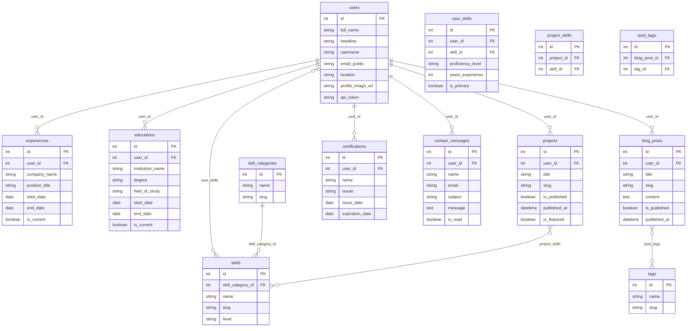

# Diagram dan ERD Proyek Portfolio

Dokumen ini memuat diagram arsitektur, Entity Relationship Diagram (ERD) database, dan diagram alur yang dipakai di dokumentasi proyek.

---

## 1. Arsitektur stack (alur klien – API)

Diagram ini menggambarkan siapa mengakses apa: pengunjung lewat web (GET publik), admin lewat panel dengan token.

Detail: [ARSITEKTUR.md](ARSITEKTUR.md).

---

## 2. Entity Relationship Diagram (ERD)

Model data di database (MySQL/MariaDB) yang dipakai oleh portfolio-api. Tabel pivot: `user_skills` (User–Skill), `project_skills` (Project–Skill), `post_tags` (BlogPost–Tag).

---

## 3. Alur publikasi (publik vs admin)

Request tanpa token hanya mendapat blog posts dan projects yang `is_published = true`; dengan token admin melihat semua.

Detail: [PUBLIKASI_WEB.md](PUBLIKASI_WEB.md).

---

## 4. Alur admin: login dan auto-fill konten

Setelah login, current user disimpan; saat buka form Tambah, field user_id terisi otomatis.

Detail: [PERANCANGAN_ADMIN.md](PERANCANGAN_ADMIN.md).

---

## 5. Alur deploy (container)

Stack dijalankan dengan Podman/Docker Compose: db → api → web, admin.

Detail: [../DEPLOY.md](../DEPLOY.md).

---

## Referensi

| Dokumen | Isi |
|---------|-----|
| [ARSITEKTUR.md](ARSITEKTUR.md) | Arsitektur stack, komponen, akses. |
| [PUBLIKASI_WEB.md](PUBLIKASI_WEB.md) | Perilaku endpoint blog-posts dan projects. |
| [PERANCANGAN_ADMIN.md](PERANCANGAN_ADMIN.md) | Fitur admin dan alur current user. |
| [../DEPLOY.md](../DEPLOY.md) | Deploy dengan Podman/Docker. |
| [../portfolio-api/app/Models/](../portfolio-api/app/Models/) | Model Eloquent (sumber kebenaran relasi). |
