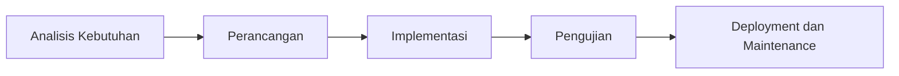

# Panduan Dokumentasi RPL (Rekayasa Perangkat Lunak)

Dokumentasi dalam RPL adalah fondasi utama agar aplikasi (Web, Mobile, maupun Desktop) dibangun terstruktur, mudah dipelihara, dan sesuai kebutuhan pengguna. Dokumen ini merangkum tahap-tahap SDLC beserta tipe dokumen penting, lalu memetakan dokumen yang ada di proyek portfolio ke tahap tersebut.

---

## Alur SDLC (ringkas)

Dokumen proyek ini terutama mencakup tahap **Perancangan**, **Implementasi**, dan **Deployment**. Tahap Analisis dan Pengujian tercakup sebagian (living doc / audit).

---

## 1. Tahap Analisis Kebutuhan (Requirement Analysis)

Tujuan: memahami apa yang akan dibangun.

| Tipe dokumen | Isi |
|--------------|-----|
| **BRD (Business Requirement Document)** | Tujuan bisnis, latar belakang masalah, nilai tambah aplikasi bagi perusahaan/klien. |
| **SRS (Software Requirement Specification)** | **Fungsional:** fitur apa saja (Login, Checkout, Push Notification, dll.). **Non-Fungsional:** kinerja, keamanan, kompatibilitas (contoh: akses di Android 10+, load time &lt; 3 detik). |
| **User Story (Agile)** | Format: "Sebagai [user], saya ingin [fitur], agar [manfaat]." |
| **MoSCoW Prioritization** | Pengelompokan fitur: Must have, Should have, Could have, Won't have. |

**Di proyek ini:** Kebutuhan fungsional dan fitur tersebar di [PERANCANGAN_ADMIN.md](PERANCANGAN_ADMIN.md), [ARSITEKTUR.md](ARSITEKTUR.md), [PUBLIKASI_WEB.md](PUBLIKASI_WEB.md), dan README subproyek. Belum ada BRD/SRS formal terpisah; untuk proyek akademik atau compliance dapat ditambah dokumen SRS ringkas (lihat [RINGKASAN_RANCANGAN.md](RINGKASAN_RANCANGAN.md) dan fitur yang telah diimplementasi sebagai acuan).

---

## 2. Tahap Perancangan (Design)

Tahap ini menerjemahkan kebutuhan menjadi blueprint teknis.

| Tipe dokumen | Isi |
|--------------|-----|
| **SDD (Software Design Document)** | Gambaran arsitektur sistem secara umum. |
| **Diagram UML** | **Use Case Diagram:** interaksi pengguna dengan sistem. **Activity Diagram:** alur proses bisnis (flowchart). **Sequence Diagram:** alur pertukaran data antar komponen. |
| **ERD (Entity Relationship Diagram)** | Desain database, tabel, dan relasi antar data. Sangat krusial untuk Web dan Mobile backend. |
| **UI/UX Design** | **Wireframe:** sketsa kasar tata letak. **Mockup/High-Fidelity:** desain visual akhir (warna, font). **Prototype:** desain yang bisa diklik untuk simulasi alur (biasanya di Figma/Adobe XD). |
| **API Design (khusus Web & Mobile)** | Dokumentasi endpoint (URL, Method, Request, Response). Tools: Swagger/OpenAPI, Postman Collection. |

**Di proyek ini:**

| Tipe | Dokumen proyek | Keterangan |
|------|-----------------|------------|
| SDD / Arsitektur | [ARSITEKTUR.md](ARSITEKTUR.md) | Stack, komponen, akses publik vs admin. |
| Diagram alur | [DIAGRAM_DAN_ERD.md](DIAGRAM_DAN_ERD.md) | Arsitektur, alur publikasi, alur admin, deploy. |
| ERD | [DIAGRAM_DAN_ERD.md](DIAGRAM_DAN_ERD.md) | Entity Relationship Diagram (Mermaid). |
| Desain fitur admin | [PERANCANGAN_ADMIN.md](PERANCANGAN_ADMIN.md) | Login, current user, relasi, menu dropdown. |
| Perilaku API | [PUBLIKASI_WEB.md](PUBLIKASI_WEB.md) | Filter publik vs admin untuk blog/projects. |
| API (endpoint) | Swagger UI di portfolio-api | `/docs` saat API berjalan; OpenAPI 3. |

---

## 3. Tahap Implementasi (Coding)

Dokumentasi saat proses penulisan kode berlangsung.

| Tipe dokumen | Isi |
|--------------|-----|
| **Code Comments** | Penjelasan pada bagian kode yang kompleks. |
| **README.md** | Panduan cara menjalankan proyek di lingkungan lokal (instalasi dependensi, konfigurasi environment variables). Struktur folder proyek. |
| **Changelog** | Catatan perubahan versi (v1.0.0, v1.0.1) dan fitur/bugfix yang dilakukan. |
| **Coding Standard** | Aturan penulisan kode (misal: PEP8 untuk Python, PSR untuk PHP) agar kode seragam. |

**Di proyek ini:**

| Tipe | Dokumen proyek | Keterangan |
|------|-----------------|------------|
| README | [README.md](../README.md) (root), [portfolio-api/README.md](../portfolio-api/README.md), [portfolio-admin/README.md](../portfolio-admin/README.md), [portfolio-web/README.md](../portfolio-web/README.md) | Setup, dependensi, cara jalankan. |
| Struktur proyek | [README.md](../README.md) | Tabel folder dan peran. |
| Changelog | Belum ada file CHANGELOG.md | Opsional: tambah untuk catatan rilis. |

---

## 4. Tahap Pengujian (Testing)

Memastikan aplikasi bebas dari bug dan sesuai spesifikasi.

| Tipe dokumen | Isi |
|--------------|-----|
| **Test Plan** | Strategi pengujian (apa yang dites, siapa yang tes, kapan). |
| **Test Case** | Skenario pengujian detail (Input apa, Expected Output apa). |
| **Bug Report** | Laporan kesalahan yang ditemukan (Langkah reproduksi, screenshot, tingkat keparahan). |
| **UAT (User Acceptance Testing) Sign-off** | Dokumen persetujuan dari klien/pengguna bahwa aplikasi sudah layak rilis. |

**Di proyek ini:**

| Tipe | Dokumen proyek | Keterangan |
|------|-----------------|------------|
| Audit keamanan | [AUDIT_REPORT_ISO27001.md](AUDIT_REPORT_ISO27001.md) | Kontrol keamanan API & admin (ISO 27001). |
| Testing API | portfolio-api: PHPUnit, `composer test` | Dijelaskan di [portfolio-api/README.md](../portfolio-api/README.md). |
| Test Plan / UAT | Belum ada dokumen formal | Dapat ditambah untuk kebutuhan compliance atau akademik. |

---

## 5. Tahap Deployment & Maintenance

Dokumen saat aplikasi diserahkan dan dijalankan.

| Tipe dokumen | Isi |
|--------------|-----|
| **User Manual / Panduan Pengguna** | Cara menggunakan aplikasi untuk end-user. |
| **Installation/Deployment Guide** | Panduan teknis untuk tim DevOps/IT untuk menaruh aplikasi di server (Cloud, VPS, App Store, Play Store). |
| **Release Notes** | Informasi fitur baru yang dirilis ke publik. |
| **Maintenance Log** | Catatan perbaikan atau update yang dilakukan setelah aplikasi hidup. |

**Di proyek ini:**

| Tipe | Dokumen proyek | Keterangan |
|------|-----------------|------------|
| Deployment Guide | [DEPLOY.md](../DEPLOY.md) | Build dan jalankan stack dengan Podman/Docker Compose; migrasi DB. |
| Release Notes / Maintenance | Belum ada dokumen terpisah | Dapat digabung dalam CHANGELOG.md bila ditambah. |

---

## Perbedaan Spesifik: Web vs Mobile

Meskipun dokumen RPL dasarnya sama, ada beberapa penekanan berbeda:

| Aspek | Aplikasi Web | Aplikasi Mobile |
|-------|----------------|------------------|
| **Desain** | Fokus pada Responsive Design (Desktop, Tablet, Mobile Web). | Fokus pada Native Guidelines (iOS Human Interface / Material Design Android). |
| **API** | Biasanya REST atau GraphQL untuk komunikasi Frontend–Backend. | Perlu mempertimbangkan Offline Mode dan sinkronisasi data. |
| **Deployment** | Server, Domain, SSL, CI/CD Pipeline. | App Store Review Guidelines, Play Store Console, Signing Key. |
| **Testing** | Kompatibilitas Browser (Chrome, Firefox, Safari). | Kompatibilitas OS (versi iOS, Android) dan Device (Layar, RAM). |
| **Keamanan** | CSRF, XSS, SQL Injection. | Secure Storage, Biometric Auth, Jailbreak/Root detection. |

---

## Metodologi dan Kelengkapan Dokumen

Kelengkapan dokumen tergantung pada metode pengembangan:

- **Waterfall:** Dokumen harus lengkap dan detail di awal sebelum coding dimulai. Cocok untuk proyek pemerintah, perbankan, atau sistem kritis.
- **Agile / Scrum:** Dokumen lebih ringkas dan hidup (living document). Fokus pada Product Backlog, User Stories, dan Working Software. Dokumentasi teknis sering digabung dalam Wiki (Confluence/Notion) yang diupdate per Sprint.

---

## Tools Rekomendasi untuk Manajemen Dokumen RPL

| Kategori | Contoh tools |
|----------|---------------|
| Manajemen Proyek & Requirement | Jira, Trello, Asana, ClickUp |
| Dokumentasi & Wiki | Confluence, Notion, Google Docs |
| Desain UI/UX | Figma, Adobe XD, Sketch |
| Diagram & Arsitektur | Draw.io, Lucidchart, Visio |
| API Documentation | Swagger UI, Postman, Redoc |
| Code Repository & Docs | GitHub, GitLab, Bitbucket (Wiki & README) |

---

## Contoh Struktur Sederhana SRS (Startup/UMKM)

Jika aplikasi startup dan tidak ingin dokumen terlalu tebal:

- **Pendahuluan:** Tujuan Aplikasi, Target Pengguna
- **Fitur Utama (Functional Requirements):** Daftar fitur (misal: Login, Dashboard, Pembayaran), alur singkat setiap fitur
- **Kebutuhan Non-Fungsional:** Keamanan (enkripsi password), Performa (max load 1000 user)
- **Desain Antarmuka:** Link ke Figma
- **Struktur Data:** Link ke ERD
- **Rencana Rilis:** MVP (Minimum Viable Product), Fase 2, Fase 3
- **Kesimpulan**

---

## Kesimpulan

Dokumentasi RPL bukan sekadar formalitas, melainkan asuransi proyek. Tanpa dokumen desain, developer bisa salah bangun fitur. Tanpa dokumen API, tim mobile dan web tidak bisa sinkron. Tanpa dokumen maintenance, aplikasi akan sulit diperbaiki jika developer asli keluar.

---

## Peta dokumen proyek ke tahap SDLC

| Tahap SDLC | Tipe dokumen RPL | Dokumen di proyek |
|------------|------------------|-------------------|
| Analisis Kebutuhan | BRD, SRS, User Story, MoSCoW | Tersirat di PERANCANGAN_ADMIN, ARSITEKTUR, README; tidak ada BRD/SRS formal. |
| Perancangan | SDD, ERD, diagram, API design | ARSITEKTUR.md, DIAGRAM_DAN_ERD.md, PERANCANGAN_ADMIN.md, PUBLIKASI_WEB.md, Swagger di API. |
| Implementasi | README, struktur, Changelog | README (root + api/admin/web), struktur di README root. |
| Pengujian | Test Plan, Test Case, Audit | AUDIT_REPORT_ISO27001.md, testing di portfolio-api/README. |
| Deployment & Maintenance | Deployment Guide, User Manual | DEPLOY.md. |

---

## Celah dan rekomendasi

- **Belum ada:** BRD/SRS formal, Test Plan tertulis, User Manual, CHANGELOG/Release Notes terpusat.
- **Rekomendasi:** Untuk proyek Agile/startup, dokumentasi existing (arsitektur, perancangan, deploy) sudah memadai sebagai living document. Untuk keperluan akademik (RPL) atau compliance, pertimbangkan menambah: (1) SRS ringkas (tujuan, fitur, non-fungsional, link ke ERD/API), (2) Test Plan singkat, (3) CHANGELOG.md untuk riwayat versi.

---

## Fokus proyek ini: Web

Proyek portfolio ini fokus **aplikasi Web** (portfolio-api, portfolio-admin, portfolio-web). Penekanan mengacu baris "Aplikasi Web" pada tabel [Perbedaan Spesifik: Web vs Mobile](#perbedaan-spesifik-web-vs-mobile) di atas (responsive design, REST API, deploy server/container). Untuk aplikasi mobile nanti, tambahkan aspek baris "Aplikasi Mobile".

---

## Referensi

- [Indeks Dokumentasi](README.md) — Daftar lengkap dokumen proyek.
- [ARSITEKTUR.md](ARSITEKTUR.md) — Arsitektur stack.
- [DIAGRAM_DAN_ERD.md](DIAGRAM_DAN_ERD.md) — ERD dan diagram alur.
- [DEPLOY.md](../DEPLOY.md) — Panduan deployment.
