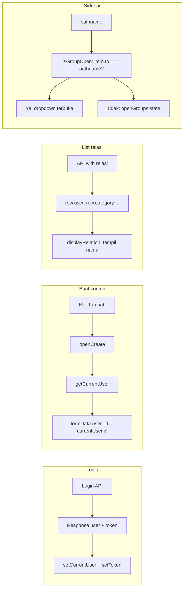

# Perancangan Admin Portfolio

Dokumen ini mendeskripsikan perancangan dan implementasi fitur Admin portfolio yang telah dikerjakan: konteks user login, tampilan relasi dengan nama (bukan ID), dan navigasi sidebar berbasis dropdown.

---

## 1. Ringkasan

| Aspek | Keterangan |
|-------|------------|
| **Ruang lingkup** | portfolio-admin (React/Vite) dan perubahan terkait di portfolio-api (Lumen) |
| **Tujuan** | Pengisian konten mengikuti user login; relasi ditampilkan sebagai nama (bukan ID); navigasi sidebar per kelompok dengan dropdown yang terbuka otomatis saat halaman aktif |

Fitur utama yang didokumentasikan:

- Login mengembalikan data user; Admin menyimpan current user dan memakainya untuk auto-fill saat buat konten.
- Form: field relasi (user_id, skill_id, dll.) berupa dropdown yang diisi dari API dan menampilkan nama.
- List: kolom relasi menampilkan nama (mis. nama user, nama skill) berkat relasi yang dikembalikan API.
- Sidebar: semua kelompok menu sebagai dropdown; kelompok yang berisi halaman aktif selalu terbuka.

---

## 2. Login dan current user

### API (portfolio-api)

- **File:** `portfolio-api/app/Http/Controllers/LoginController.php`
- Response login mengembalikan objek `user` bersama `token`. User berisi: `id`, `full_name`, `username` (tanpa password/token di objek user).

### Admin (portfolio-admin)

- **File:** `portfolio-admin/src/auth.js`
  - `getCurrentUser()` — membaca user dari sessionStorage.
  - `setCurrentUser(user)` — menyimpan atau menghapus user (sessionStorage key: `PORTFOLIO_ADMIN_USER`).
  - `clearToken()` — menghapus token dan user dari sessionStorage.

- **File:** `portfolio-admin/src/pages/Login.jsx`
  - Setelah login sukses, jika response memuat `res?.data?.user`, memanggil `setCurrentUser(res.data.user)`.

---

## 3. Auto-fill user_id saat buat konten

- **File:** `portfolio-admin/src/pages/ResourcePage.jsx`, fungsi `openCreate()`
- Inisialisasi form: untuk setiap field di `cfg.formFields`, jika field adalah `user_id` dan `getCurrentUser()?.id` ada, maka `formData.user_id` diisi dengan `currentUser.id`. Field lain diisi default: string kosong atau `false` untuk checkbox.
- Dengan demikian, saat admin menambah konten baru (blog post, experience, project, dll.), field User otomatis terisi dengan user yang sedang login.

---

## 4. Form: field relasi sebagai select (nama, bukan ID)

### Konfigurasi

- **File:** `portfolio-admin/src/resourceConfig.js`
- Field relasi (user_id, skill_category_id, skill_id, project_id, blog_post_id, tag_id) memakai:
  - `type: 'selectRemote'`
  - `optionsEndpoint` — endpoint untuk mengambil daftar (mis. `'users'`, `'skills'`).
  - `optionLabel` — properti yang ditampilkan (mis. `'full_name'`, `'name'`).
  - `optionValue` — nilai yang disimpan (umumnya `'id'`).
- Label form memakai nama (mis. "User", "Kategori", "Skill") bukan "User ID".

### ResourcePage

- **File:** `portfolio-admin/src/pages/ResourcePage.jsx`
- State `formFieldOptions`: menyimpan opsi per field selectRemote.
- `useEffect`: untuk setiap form field dengan `type === 'selectRemote'`, memanggil `getList(f.optionsEndpoint, { per_page: 100 })` dan mengisi `formFieldOptions[f.key]` dengan `{ value, label }`.
- Render form: untuk `type === 'selectRemote'` menampilkan `<select>` dengan opsi dari `formFieldOptions[f.key]`; nilai disimpan sebagai number bila `optionValue === 'id'`.

---

## 5. List: tampilan relasi dengan nama

### Konfigurasi

- **File:** `portfolio-admin/src/resourceConfig.js`
- Pada `listColumns`, kolom relasi menambah `displayRelation: { key, labelKey }`:
  - `key` — nama relasi di objek row dari API (mis. `'user'`, `'category'`, `'post'`, `'tag'`).
  - `labelKey` — properti nama di objek relasi (mis. `'full_name'`, `'name'`, `'title'`).
- Nama relasi mengikuti API (contoh: Skill memakai `category`, PostTag memakai `post`).

### ResourcePage

- **File:** `portfolio-admin/src/pages/ResourcePage.jsx`
- Saat render sel tabel: jika kolom punya `displayRelation`, nilai yang ditampilkan = `row[displayRelation.key]?.[displayRelation.labelKey] ?? row[column.key]`. Jika tidak, tetap nilai kolom seperti biasa (termasuk penanganan is_published, is_read, dll.).
- API sudah mengembalikan relasi (controller memakai `with('user')`, `with('category')`, dll.), sehingga objek row memuat `row.user`, `row.category`, dan seterusnya.

---

## 6. Menu sidebar: dropdown per kelompok

### Struktur

- **File:** `portfolio-admin/src/components/AdminLayout.jsx`
- `menuGroups` berisi lima kelompok:
  - **Utama:** Dashboard
  - **Konten:** Blog Posts, Tags, Post Tags
  - **Portfolio:** Users, Experiences, Educations, Projects, Certifications
  - **Skills:** Skill Categories, Skills, User Skills, Project Skills
  - **Lainnya:** Contact Messages
- Semua kelompok di-render sebagai dropdown: tombol label kelompok + daftar link item.

### Logika buka/tutup

- `isGroupOpen(gIdx)`:
  - Mengembalikan `true` jika ada item di kelompok tersebut yang `to === location.pathname` (halaman aktif ada di kelompok itu), sehingga dropdown kelompok yang berisi halaman aktif selalu terbuka.
  - Jika tidak ada item aktif, mengembalikan `openGroups[gIdx] ?? false` (default tertutup).
- `toggleGroup(gIdx)` mengubah `openGroups[gIdx]` saat user mengklik label kelompok.

### Gaya

- Tombol kelompok dan chevron (rotasi 180° saat terbuka).
- **File:** `portfolio-admin/src/index.css` — kelas `.admin-nav-group-btn:hover` untuk umpan balik visual.

---

## 7. Diagram alur

---

## Referensi file utama

| Fitur | File |
|-------|------|
| Login response user | `portfolio-api/app/Http/Controllers/LoginController.php` |
| Current user (auth) | `portfolio-admin/src/auth.js` |
| Set user setelah login | `portfolio-admin/src/pages/Login.jsx` |
| Auto-fill, form select, list relasi | `portfolio-admin/src/pages/ResourcePage.jsx` |
| Konfigurasi form & list | `portfolio-admin/src/resourceConfig.js` |
| Menu dropdown | `portfolio-admin/src/components/AdminLayout.jsx` |
| Gaya tombol kelompok | `portfolio-admin/src/index.css` |
