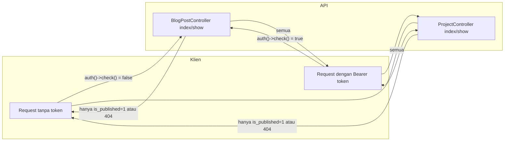

# Publikasi Web: Perilaku API untuk Publik vs Admin

Dokumen ini mendeskripsikan perilaku yang sudah diimplementasi: request **tanpa token** hanya mendapat konten yang dipublikasi untuk blog-posts dan projects; request **dengan token** (admin) mendapat semua data termasuk draft.

---

## Tujuan

- Situs publik dan crawler tidak melihat draft blog atau project.
- Admin (dengan Bearer token) tetap dapat list dan edit semua item, termasuk draft.
- Tidak ada middleware baru: controller memakai `auth()->check()` untuk membedakan pemanggil.

---

## Tabel perilaku endpoint

| Endpoint | Tanpa token (publik) | Dengan token (admin) |
|----------|----------------------|----------------------|
| **GET /api/blog-posts** | Hanya item dengan `is_published = true` | Semua item; filter `is_published` dari query string tersedia |
| **GET /api/blog-posts/{id}** | 404 jika item draft (`is_published = false`) | Selalu by id (draft maupun published) |
| **GET /api/projects** | Hanya item dengan `is_published = true` | Semua item |
| **GET /api/projects/{id}** | 404 jika project belum published | Selalu by id |

Resource lain (users, experiences, educations, skills, tags, certifications, dll.) tidak memakai flag publish; GET tanpa token mengembalikan data yang sama. Mutasi (POST/PUT/PATCH/DELETE) dan akses contact-messages memerlukan token.

---

## Referensi kode

- **Blog posts:** [portfolio-api/app/Http/Controllers/BlogPostController.php](../portfolio-api/app/Http/Controllers/BlogPostController.php)
  - `index()`: jika `!auth()->check()` maka `$query->where('is_published', true)`; jika terautentikasi dan request punya `is_published`, filter sesuai query.
  - `show($id)`: jika tidak terautentikasi dan `!$item->is_published`, kembalikan 404.
- **Projects:** [portfolio-api/app/Http/Controllers/ProjectController.php](../portfolio-api/app/Http/Controllers/ProjectController.php)
  - `index()`: jika `!auth()->check()` maka `$query->where('is_published', true)`.
  - `show($id)`: jika tidak terautentikasi dan `!$item->is_published`, kembalikan 404.

---

## Diagram alur (ringkas)

